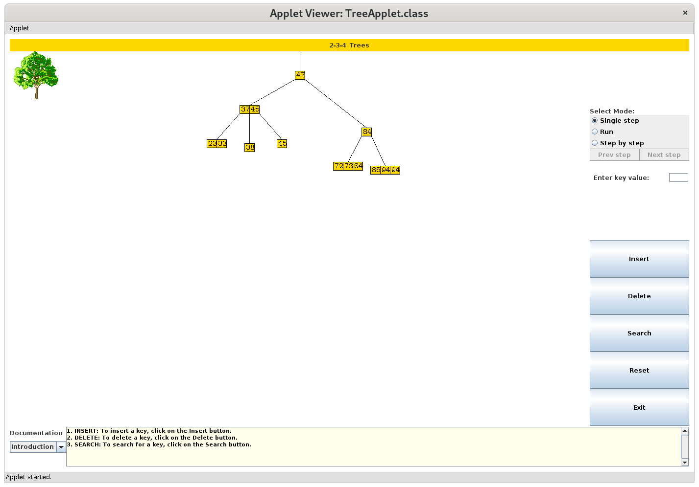

# Animated Working of 234-Trees

A Two-Three-Four tree is a simple form of a B-Tree. This Java applet shows the
working of a 234-Tree. All operations -- INSERT, DELETE and SEARCH, can be run
in any of the three modes -- single step, run, and step by step, to understand
the steps involved. Nodes and branches can be dragged and moved freely.

## Running

Download the sources and run `make` to generate the compile the sources. To run
it offline:

``` $ appletviewer tree.html ```



